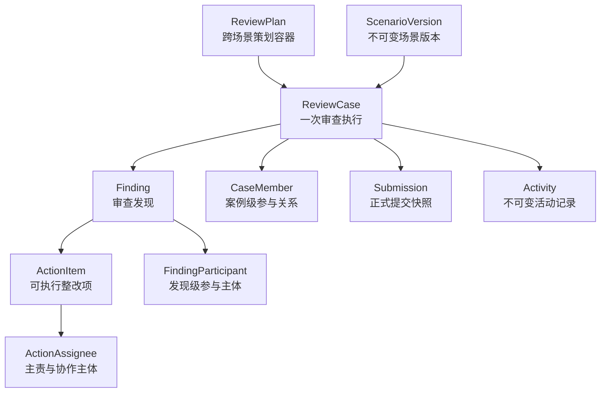

# M0.1 核心领域模型

## 目标

M0.1 冻结核心概念的责任和依赖方向，同时建立 FastAPI/PostgreSQL 工程底座。核心模型必须能先承载“过程审查”，再由差异明显的第二场景验证扩展性。

## 核心概念职责

| 概念 | 唯一职责 | 不负责 |
|---|---|---|
| Scenario | 声明不可变场景版本、角色键与输入校验策略 | 复制一套核心 API 或覆盖历史版本 |
| ReviewPlan | 表达年度、周期或专项策划意图，可包含不同 Scenario 的 Case | 决定所有 Case 的 Scenario |
| ReviewCase | 一次可独立追踪、协作和关闭的审查执行容器，并固定 ScenarioVersion | 代替组织、账号或场景定义 |
| Finding | 记录审查中确认的问题或风险 | 直接等同整改任务 |
| ActionItem | 将 Finding 拆成可跟踪的执行项 | 冻结单一负责人 |
| ActionAssignee | 建立 User/Department 与 ActionItem 的主责或协作关系 | 充当平台 RBAC |
| CaseMember | 建立用户与 ReviewCase 的业务角色关系 | 充当平台 RBAC |
| FindingParticipant | 建立 User/Department 与 Finding 的责任或协作关系 | 继承全部案例权限 |
| Activity | 保存可审计、不可变的事实事件 | 保存可反复编辑的表单草稿 |
| Submission | 保存一次正式提交的原始表达与业务目的 | 取代结构化领域状态 |

## 已冻结不变量

1. `ReviewPlan` 是跨场景容器，不保存 `scenario_key`。
2. `ReviewCase` 可以独立创建，也可以选择性来源于一个 `ReviewPlan`；关联时二者必须属于同一 Organization。
3. 每个 `ReviewCase` 固定保存 `scenario_key + scenario_version`；Registry 必须精确返回该不可变版本。
4. Registry 的新版注册不得覆盖旧版；`get(key, version)` 用于解释历史 Case，`get_latest(key)` 仅用于新建 Case。
5. `Finding` 只属于一个 `ReviewCase`；`ActionItem` 只属于一个 `Finding`。
6. ActionItem 不保存单值 `owner_id`；User 和 Department 通过多个 `ActionAssignee` 成为主责或协作主体。
7. FindingParticipant 同样支持 User 与 Department。
8. 平台角色只保留 `system_admin` 与 `ordinary_user`；案例和发现中的业务身份由关系实体表达。
9. `Activity` 与 `Submission` 分离：前者记录事实，后者保留正式用户表达。

## Activity 的持久化边界

领域层使用 `ReviewCaseActivitySubject`、`FindingActivitySubject`、`ActionItemActivitySubject`、`SubmissionActivitySubject` 表达事件目标。这是一个封闭、类型化的领域联合类型，不是数据库 Generic Reference。

M1 持久化必须满足：

- 核心目标均由真实外键约束。
- 可采用多个可空的类型化外键并配合“恰有一个非空”的 Check Constraint，或采用各目标类型的关联表。
- 不得建立 `subject_type + subject_id` 且无目标外键的 Generic FK。
- User/Department 多态参与关系同样必须分别映射到受约束外键。

## 暂不冻结

- 完整权限矩阵和登录方式。
- 各场景表单 schema 与页面布局。
- 状态转换命令、审批策略和超时规则。
- 通知渠道、催办节奏和管理仪表盘指标。
- 正式领域表字段与旧版数据迁移映射。
