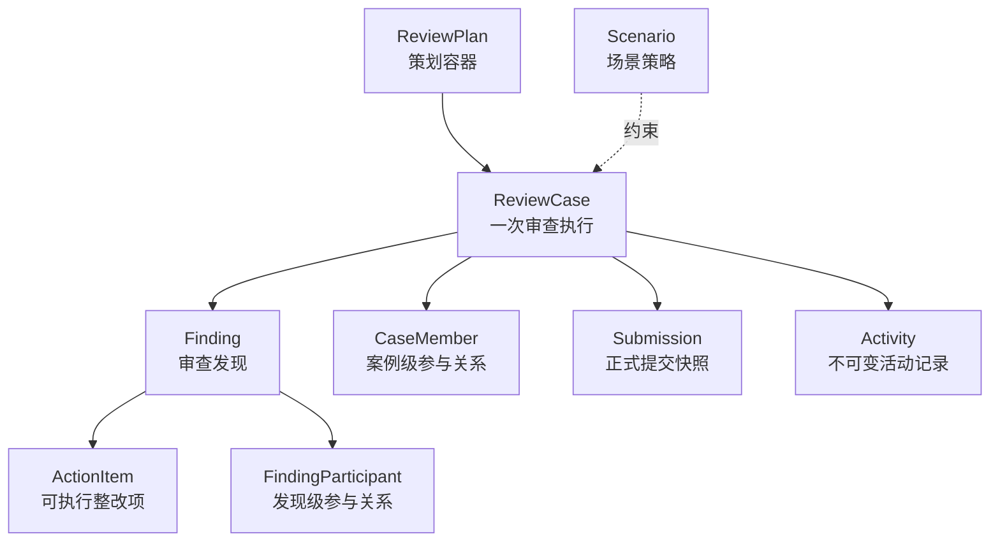

# M0 核心领域模型

## 目标

M0 冻结核心概念的责任和依赖方向，不试图一次冻结全部字段、页面与场景流程。核心模型必须能先承载“过程审查”，再由差异明显的第二场景验证扩展性。

## 九个概念的职责

| 概念 | 唯一职责 | 不负责 |
|---|---|---|
| Scenario | 声明场景版本、角色键与场景输入校验策略 | 复制一套核心 API 或页面 |
| ReviewPlan | 表达一次或一组审查活动的策划意图 | 承载实际审查证据 |
| ReviewCase | 一次可独立追踪、协作和关闭的审查执行容器 | 代替组织、账号或场景定义 |
| Finding | 记录审查中确认的问题或风险 | 直接等同整改任务 |
| ActionItem | 将 Finding 拆成有负责人和期限的执行项 | 表达完整审查结论 |
| CaseMember | 建立用户与 ReviewCase 的业务角色关系 | 充当平台 RBAC |
| FindingParticipant | 建立用户与 Finding 的责任或协作关系 | 继承全部案例权限 |
| Activity | 保存可审计、不可变的事实事件 | 保存可反复编辑的表单草稿 |
| Submission | 保存一次正式提交的原始表达与业务目的 | 取代结构化领域状态 |

## 已冻结不变量

1. `ReviewCase` 可以独立创建，也可以选择性来源于一个 `ReviewPlan`。
2. 关联的 Plan 与 Case 必须属于同一 Organization 和同一 Scenario。
3. `Finding` 必须且只属于一个 `ReviewCase`；`ActionItem` 必须且只属于一个 `Finding`。
4. 平台角色只保留 `system_admin` 与 `ordinary_user`；案例和发现中的业务身份由关系实体表达。
5. Scenario 以版本化策略注册，不允许核心层出现按具体场景分支的条件堆叠。
6. `Activity` 与 `Submission` 是不同概念：前者记录事实，后者保留正式用户表达。

## 暂不冻结

- 完整权限矩阵和登录方式。
- 各场景的表单 schema 与页面布局。
- 状态转换命令、审批策略和超时规则。
- 通知渠道、催办节奏和管理仪表盘指标。
- 旧版数据迁移映射。
