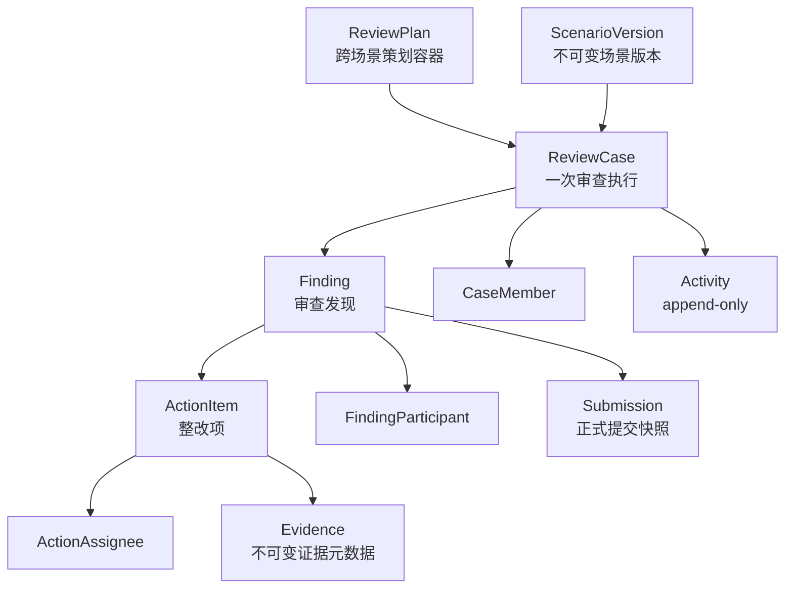

# 领域模型

本文描述当前代码中的领域事实。代码与本文冲突时以代码和测试为准，并同步修正本文。

## 核心概念



| 概念 | 职责 | 不负责 |
|---|---|---|
| Scenario / ScenarioVersion | 不可变的场景版本：工作流、权限、角色、输入校验、提醒收件人语义 | 覆盖历史版本；复制核心 API |
| ReviewPlan | 跨 Scenario 的策划容器 | 决定 Case 的 Scenario |
| ReviewCase | 一次可独立追踪和关闭的审查，固定 `scenario_key + scenario_version` | 充当组织或账号 |
| Finding | 审查中确认的问题或风险；验证对象 | 直接等同整改任务 |
| ActionItem | Finding 下可跟踪的执行项 | 自己的审批状态；单值 `owner_id` |
| CaseMember / FindingParticipant / ActionAssignee | 业务角色关系（User 或 Department） | 平台 RBAC |
| Submission | 正式提交的原始表达（整改计划/完成/验证结论） | 取代结构化状态 |
| Evidence | 挂在 ActionItem 上的不可变证据元数据（名称、类型、大小、SHA-256、存储键） | 授权凭证 |
| Activity | 可审计的业务事实，数据库禁止 UPDATE/DELETE | 通知或提醒历史 |
| Notification | 投递给某个 User 的站内消息（见 architecture.md） | 业务真相或待办 |

平台账号角色只有 `system_admin` 与 `ordinary_user`。`system_admin` 没有任何业务可见性或业务权限捷径。

## 不变量

1. 所有业务对象与关系属于同一 Organization，由组合外键在数据库层保证。
2. 每个 ReviewCase 按 `(scenario_key, scenario_version)` 精确解释；新建 Case 时显式选择一个已发布的精确版本，已有 Case 永远保持创建时绑定的版本，不自动升级。
3. Finding 只属于一个 ReviewCase；ActionItem 只属于一个 Finding。
4. FindingParticipant / ActionAssignee 是 User 或 Department 二选一（数据库 XOR 约束）。
5. Activity、Submission、Evidence 是 append-only，由数据库触发器保证；更正只能追加新事实。
6. 生命周期只能通过命令改变（transition / submission），不能在创建或 PATCH 时由客户端指定。
7. 已关闭的 ReviewCase 下不存在非终态 Finding（终态 = `closed` / `voided`）。
8. `verifying` 意味着存在正式完成提交，且切换时所有未取消的 ActionItem 均为 `done`（至少一个）。
9. 每个 ReviewCase 至少保留一名有效管理者（持有 `manage_case_members` 的活跃用户）；移除成员和停用用户都不能打破这一点。

## Scenario 机制

- `ScenarioPolicy` 提供能力：`case_creation`、`case_workflow`、`finding_workflow`、`finding_operations`、`finding_direct_transitions`、`action_workflow`、`action_operations`、`authorization`、`collaboration_recipients`、`submission_policy`，以及 `validate_case_input` / `validate_finding_input`。
- Review Core 只定义 Protocol 和场景无关的上下文/决策对象；具体动作名、角色名和规则只在 `scenarios/<key>/v<n>.py` 中出现。
- 只有 `composition.py` 可以 import `scenarios`，并在此注册所有版本。
- `RoleSpecification` 声明每个角色允许的主体类型（User/Department）和权限来源（direct / department_membership）。
- 组织需要先发布（`easyaudit-next publish-scenario`）某个 Scenario 版本才可以用它新建 Case；缺少精确版本时拒绝，不回退到相近版本。
- `scenario_data` 是 JSONB，由对应版本校验；通用代码只透传，不解释其中字段。

## process_review@1

**ReviewCase**

```text
draft --schedule--> scheduled --start--> in_progress --finish_fieldwork--> awaiting_closure --close--> closed
awaiting_closure --reopen_fieldwork(reason)--> in_progress
draft / scheduled --cancel(reason)--> cancelled
```

`close` 要求所有 Finding 为终态。`reopen_fieldwork` 用于误点“完成现场工作”或需要补录发现项：原因必填，权限与其他 Case 流转相同（`transition_case`），Activity（`review_case.transitioned`）记录原因；`fieldwork_completed_at` 清空（再次完成时重新记录），`started_at` 保持首次开始时间。`closed` / `cancelled` 仍是终态。自动提醒按当前 lifecycle 计算，恢复后活动重新成为逾期提醒候选，不需要撤销任何已排期提醒。

**Finding**

```text
open --issue--> rectifying --submit_for_verification--> verifying
verifying --approve--> closed
verifying --reject(reason)--> rectifying
open --void(reason)--> voided
closed --reopen(reason)--> rectifying
```

- `reopen` 的目标状态由 Scenario 按 Finding 类型决定。compliance_review 的 `observation` 从未进入整改，重开后回到 `open`（可再次 `accept_observation`，不产生 ActionItem 或整改记录）；`nonconformity` 重开后进入 `rectifying`。
- 只能在 Case `in_progress` 时新建 Finding；`in_progress` 或 `awaiting_closure` 时可 issue / void。
- `issue` 需要已有 `owner`（User）和 `responsible_department`（Department）。
- `submit_plan` 是 `rectifying` 状态下的计划提交，不改变生命周期。

**ActionItem**

```text
todo --start--> in_progress --complete--> done
todo / in_progress --cancel(reason)--> cancelled
done --reopen--> in_progress
```

整改操作要求 Case 为 `in_progress` / `awaiting_closure` 且 Finding 为 `rectifying`。

**转交并重开**（`transfer_and_reopen_action`）：`done` 的整改项在执行人无法继续（典型：全部执行人已被停用）时，不能靠"追加执行人"恢复——`done` 状态冻结执行人变更，放开它会让已完成事实上的任何人都能改动责任归属。因此用一个原子命令代替：
- 前置条件：Case `in_progress` / `awaiting_closure`、Finding `rectifying`、ActionItem `done`；必填原因；新执行人是同组织的**活跃用户**，以 `primary` 加入。
- 同一事务内：ActionItem `done → in_progress`（场景 `reopen` 流转的目标状态，`completed_at` 清空，与普通重开一致）；追加新执行人（已是 `primary` 时不重复插入）；移出已停用用户的执行关系；写一条 `action_item.transferred_and_reopened` Activity。
- 历史保留在 Activity（append-only）：原因、原 `completed_at`、完整的原执行人列表、被移出的执行人、新执行人。原来的完成/提交记录不改动。仍然活跃的原执行人（含协作人）保持原样。
- 授权由场景定义，两个 v1 场景都给 Finding `owner`；`system_admin`、Case 角色（含 `lead`）、原执行人都没有这个权限。
- 新执行人收到与"添加执行人"相同的站内通知（来源为这条 Activity）。

**角色与权限**

| 关系 | 角色 | 主体 |
|---|---|---|
| CaseMember | `lead`、`auditor`、`reviewer`、`observer` | User |
| FindingParticipant | `responsible_department` | Department（仅带来可见性） |
| FindingParticipant | `owner`、`collaborator` | User |
| ActionAssignee | `primary`、`collaborator` | User |

| 权限 | 授予 |
|---|---|
| `create_case` | 组织内任一活跃用户（创建者自动成为 `lead`） |
| `view_case` / `view_finding` | 任一 Case 角色、Finding owner/collaborator、责任部门成员、Action primary/collaborator |
| `manage_case_members` / `transition_case` | `lead` |
| `create_finding` / `issue_finding` / `manage_finding_participants` | `lead`、`auditor` |
| `create_action` / `manage_action_assignees` / `submit_rectification` | Finding `owner` |
| `transfer_and_reopen_action` | Finding `owner` |
| `update_assigned_action` | Action `primary`、`collaborator` |
| `add_rectification_evidence` | Finding `owner`、Action `primary`、`collaborator` |
| `verify_finding` | `reviewer` |
| `reopen_finding` | `lead`、`auditor`、`reviewer` |

部门关系只带来可见性，不带来任何写权限。

**scenario_data**：Case 需要 `area_code`、`review_type`；Finding 需要 `issue_type`、`project_category`。

## compliance_review@1

与 process_review@1 共享 Case（含 `reopen_fieldwork`）与 ActionItem 生命周期、角色集合和大部分权限，区别在于：

- Finding 必须声明 `finding_type`：`nonconformity` 或 `observation`。
  - `nonconformity` 走整改 → 验证的完整路径。
  - `observation` 通过 `accept_observation` 直接 `open → closed`，不需要 ActionItem 或整改提交。
- `accept_observation` 权限授予 `reviewer`。
- scenario_data：Case 需要 `standard_reference`、`scope_summary`；Finding 需要 `criterion_reference`、`finding_type`。

## 提醒收件人

提醒收件人是 Scenario 定义的语义，不等同于权限。通用编排只按意图询问精确版本：

| 意图 | 两个 v1 场景当前映射到 |
|---|---|
| `FINDING_RECTIFICATION` | `submit_rectification` |
| `ACTION_EXECUTION` | `update_assigned_action` |
| `CASE_DEADLINE` | `transition_case` |

这个映射属于场景版本，另一个场景可以给出不同的映射，不需要改动通用代码。

## 暂不建模

- Finding 截止日期（没有 `Finding.due_at`，不从其他字段推导）。
- 百分比进度、管理者角色、督办实体、提醒生命周期实体。
- 旧版 `EasyAudit_Project` 数据迁移。
